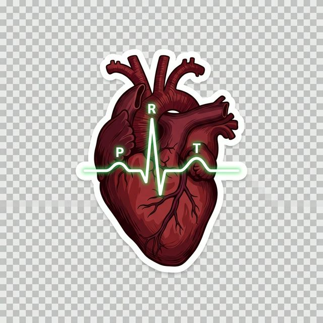
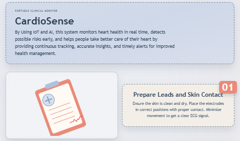
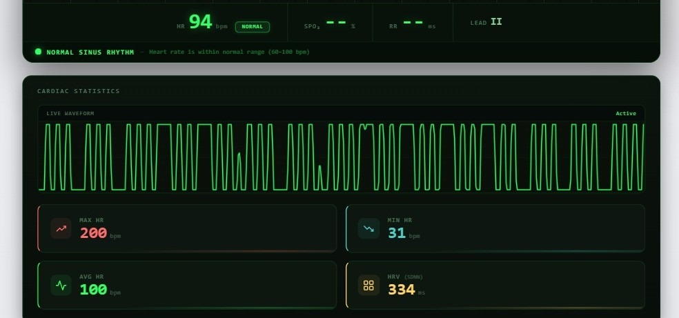
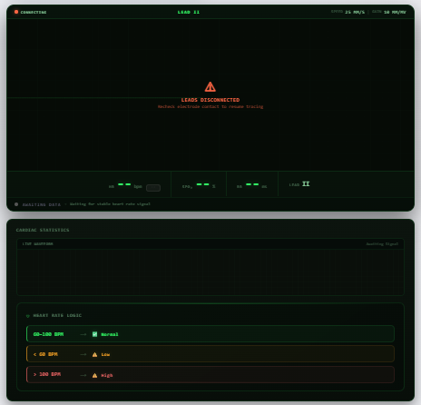
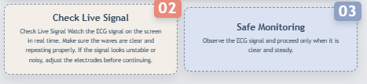
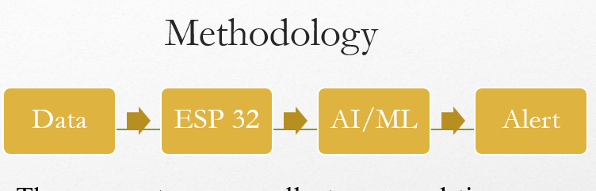
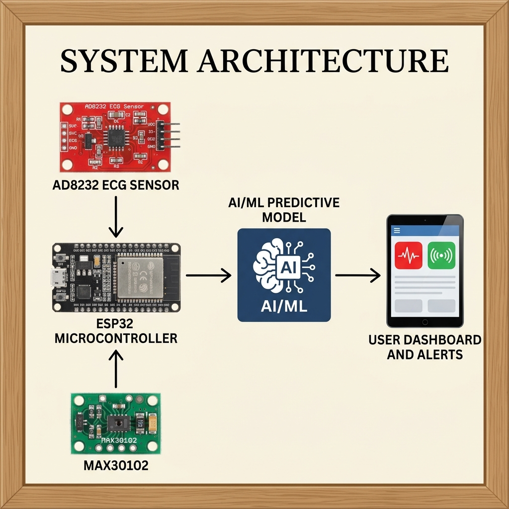
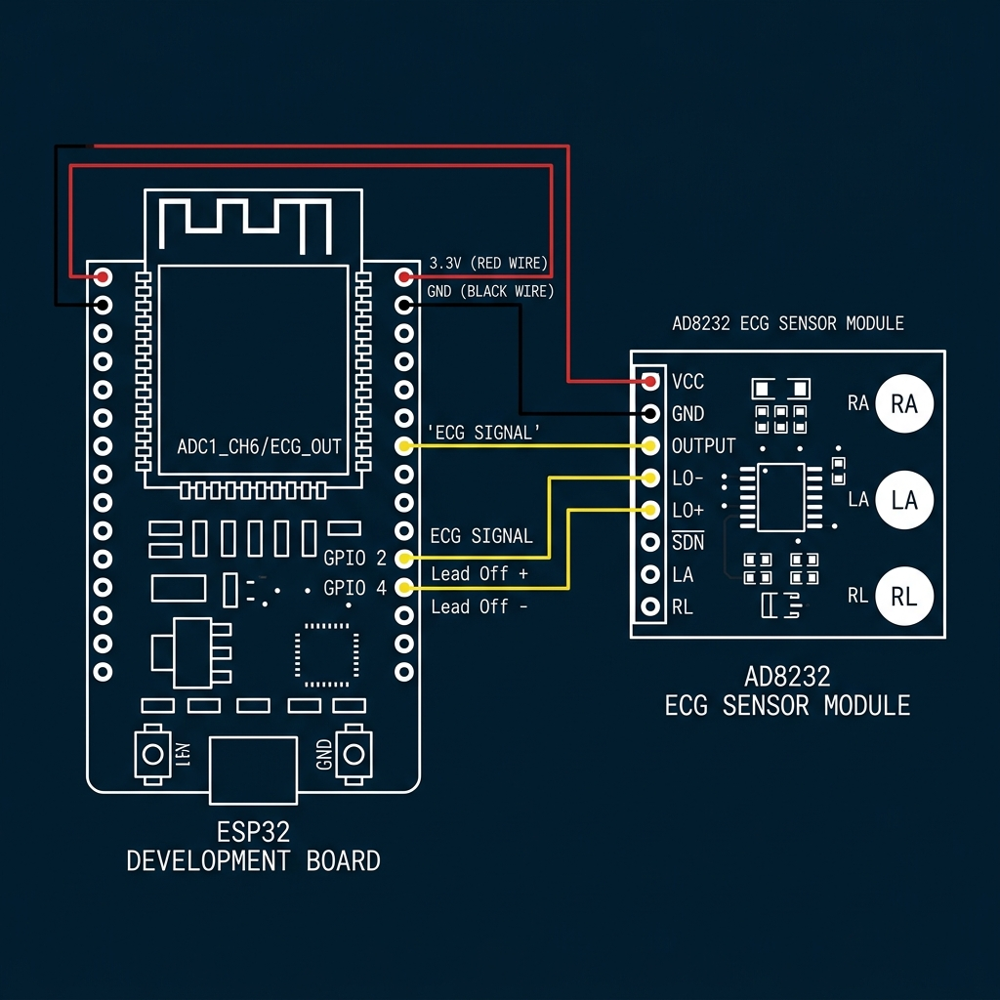

<div align="center">



# 💓 CardioSense — ESP32 + AD8232 Web ECG Monitor

<p align="center">
  
</p>

<p align="center">
  
  
  
  
  
  
  
</p>

<p align="center">
  <b>A portable, real-time ECG monitoring system built on ESP32 + AD8232.</b><br/>
  Streams live heart-rate waveforms directly to any web browser over Wi-Fi — no internet required.
</p>

---

</div>

## 📸 Screenshots & UI Previews

<div align="center">

### 🏥 Dashboard Overview & Usage Instructions


<br/>

### 🖥️ Live Cardiac Statistics Panel


> *Live ECG waveform with real-time cardiac statistics — HR 94 BPM (Normal Sinus Rhythm), Max HR, Min HR, Avg HR, and HRV (SDNN) all displayed simultaneously.*

<br/>

### ⚠️ Intelligent Lead-Off Detection


<br/>

### 📋 Signal Monitoring Instructions


<br/>

### ⚙️ System Methodology


<br/>

### 🫀 Project Logo — P·QRS·T Wave Anatomy


</div>

---

## 🏗️ System Architecture

<div align="center">

### Hardware Data Flow — AD8232 → ESP32 → AI/ML → Dashboard



> *Complete system architecture: The AD8232 ECG sensor and MAX30102 SpO₂ sensor feed into the ESP32 microcontroller, which applies AI/ML signal processing and serves the result to the user dashboard via Wi-Fi.*

<br/>

### Software Pipeline Diagram


</div>

```
┌─────────────────────────────────────────────────────────────────────┐
│                    CARDIOSENSE — DATA FLOW                          │
├─────────────────────────────────────────────────────────────────────┤
│                                                                     │
│  [Patient Electrodes]                                               │
│       ↓  (analog bio-signal)                                        │
│  [AD8232 ECG Sensor]  ──── amplifies & filters analog ECG          │
│       ↓  (0–3.3V analog)                                           │
│  [ESP32 GPIO 34]  ─────── 12-bit ADC @ 500 Hz sampling            │
│       ↓  (raw int 0–4095)                                          │
│  [DSP Notch Filter]  ──── kills 50 Hz + 60 Hz mains hum            │
│       ↓                                                             │
│  [Moving Average] ──────── 5-sample MA + variance check            │
│       ↓                                                             │
│  [R-Peak Detector] ─────── adaptive threshold BPM calc             │
│       ↓                                                             │
│  [Ring Buffer 3000]  ───── circular sample store                   │
│       ↓  (JSON /ecg endpoint)                                      │
│  [ESP32 WebServer]  ────── LittleFS serves HTML/CSS/JS             │
│       ↓  (HTTP GET every 80ms)                                     │
│  [Browser Canvas]  ─────── phosphor-green sweep ECG trace          │
│       ↓                                                             │
│  [HR Classification]  ──── Normal / Bradycardia / Tachycardia      │
│                                                                     │
└─────────────────────────────────────────────────────────────────────┘
```

---

## ✨ Key Features

| Feature | Details |
|---|---|
| 📡 **Wi-Fi Access Point** | ESP32 creates its own hotspot — no router needed |
| 📈 **500 Hz Sampling** | 12-bit ADC for clinical-grade resolution |
| 🎛️ **DSP Dual Notch Filter** | Hardware-grade 50 Hz **and** 60 Hz mains hum removal |
| 🫀 **Adaptive R-Peak BPM** | Pan-Tompkins-inspired threshold with 8-beat averaging |
| 🌐 **Browser-Native UI** | Hospital phosphor-green ECG on HTML5 Canvas — no app needed |
| 📊 **Cardiac Statistics** | Live HRV (SDNN), Max/Min/Avg HR tracking |
| 🔄 **Auto-Gain Scaling** | Signal automatically scales regardless of ADC offset |
| ⚠️ **Lead-Off Detection** | Software variance check + hardware LO+/LO- pins |
| 💾 **LittleFS File System** | Serves full web app directly from ESP32 flash |
| 📱 **Fully Responsive** | Works on mobile, tablet, and desktop |

---

## 🔩 Hardware Requirements

| Component | Specification | Qty |
|---|---|---|
| **ESP32 Dev Board** | Any 30/38-pin ESP32 (WROOM-32 recommended) | 1 |
| **AD8232 ECG Module** | SparkFun / clone — 3-lead ECG front-end | 1 |
| **Snap Electrodes** | Disposable 3M Red Dot or equivalent | 3 |
| **Electrode Lead Wires** | 3-lead patient cable with snaps | 1 set |
| **USB Cable** | Micro-USB or USB-C (board-dependent) | 1 |
| **Breadboard** | Optional, for prototyping connections | 1 |
| **Jumper Wires** | Male-to-female dupont wires | ~6 |

---

## 🔌 Wiring Diagram

<div align="center">

</div>

### 📋 Pin Connection Table

```
AD8232 Pin   →   ESP32 GPIO       Function
──────────────────────────────────────────────────────
  OUTPUT     →   GPIO 34          ECG analog signal (ADC1_CH6)
  LO+        →   GPIO 2           Lead-off detect positive
  LO-        →   GPIO 4           Lead-off detect negative
  3.3V       →   3.3V             Module power supply
  GND        →   GND              Common ground
  SDN        →   (leave floating) Shutdown pin, NC by default
```

> [!WARNING]
> **GPIO 34 is INPUT-ONLY** on ESP32 — do NOT connect it to a 5V signal. The AD8232 operates at 3.3V, which is directly compatible.

> [!NOTE]
> `SKIP_LEAD_OFF` is set to `true` by default in `main.cpp`. Lead-off detection uses **software variance checking** instead of the hardware LO pins, allowing the monitor to display raw signals at all times.

### 🩺 Electrode Placement (Lead II Configuration)

```
        RA (Right Arm)  ──→  Right side of chest / below clavicle
        LA (Left Arm)   ──→  Left side of chest / below clavicle
        RL (Right Leg)  ──→  Lower left abdomen / left hip (reference/ground)
```

---

## 🛠️ Software Stack

```
📁 ECG Mini Project/
├── 📄 platformio.ini          ← PlatformIO build config (ESP32, LittleFS, 921600 baud)
├── 📁 src/
│   └── 📄 main.cpp            ← ESP32 firmware (C++/Arduino)
│       ├── Network setup (AP mode hotspot)
│       ├── DSP dual notch filter (50Hz + 60Hz)
│       ├── 5-sample moving average filter
│       ├── Variance-based lead-off detection
│       ├── Adaptive R-peak BPM detector
│       ├── Ring buffer (3000 samples)
│       ├── LittleFS static file server
│       └── JSON /ecg streaming API
└── 📁 data/                   ← LittleFS web app (uploaded to ESP32 flash)
    ├── 📄 index.html          ← Single-page ECG monitor UI
    ├── 📄 styles.css          ← Hospital-style dark theme + animations
    ├── 📄 app.js              ← Canvas ECG renderer + HR logic (661 lines)
    └── 🖼️  heart.png          ← Anatomical heart sticker asset
```

---

## 🚀 Getting Started — Step by Step

### Prerequisites

Make sure you have the following installed:

```bash
# Install PlatformIO CLI (or use VS Code PlatformIO extension)
pip install platformio

# Verify installation
pio --version
```

- **VS Code** with **PlatformIO IDE Extension** *(recommended)*
- **Python 3.6+** (required by PlatformIO)
- **USB driver** for your ESP32 (CH340 or CP2102)

---

### Step 1 — Clone / Open the Project

```bash
# If using Git
git clone https://github.com/infi-dev0/Intelligent-Heart-Health-Monitoring-System-Using-AI-and-IoT.git
cd "Intelligent-Heart-Health-Monitoring-System-Using-AI-and-IoT"

# Or simply open the folder in VS Code
code "ECG mini project"
```

---

### Step 2 — Configure Wi-Fi Credentials *(Optional)*

> By default, the ESP32 creates its own **Access Point** (hotspot). No changes needed unless you want to connect to an existing Wi-Fi router.

Open `src/main.cpp` and find the network section:

```cpp
// ── Network Configuration ──────────────────────
static const bool  USE_SOFT_AP   = true;          // true = hotspot mode (default)
static const char* AP_SSID       = "ECG Setup";   // Hotspot network name
static const char* AP_PASSWORD   = "0123456789";  // Hotspot password (min 8 chars)

// If USE_SOFT_AP = false, fill in your router credentials:
static const char* WIFI_SSID     = "Your_Router_SSID";
static const char* WIFI_PASSWORD = "Your_Router_Password";
```

---

### Step 3 — Upload Firmware to ESP32

```bash
# Using PlatformIO CLI
pio run --target upload

# Or in VS Code: click the → Upload button in PlatformIO toolbar
```

> [!IMPORTANT]
> Select the correct **COM port** for your ESP32. Check Device Manager (Windows) or `ls /dev/tty*` (Linux/Mac).

---

### Step 4 — Upload Web App to LittleFS (Flash Filesystem)

This step uploads the `data/` folder (HTML, CSS, JS, PNG) to the ESP32's internal flash:

```bash
# Upload filesystem image
pio run --target uploadfs

# Or in VS Code: PlatformIO → Project Tasks → Upload Filesystem Image
```

> [!IMPORTANT]
> You **must** run this step separately from the firmware upload. It uses the LittleFS partition. If you skip this, the browser will show: `index.html not found`.

---

### Step 5 — Monitor Serial Output

Open Serial Monitor at **115200 baud** to confirm startup:

```bash
pio device monitor --baud 115200
```

Expected output:
```
Lead-off detection BYPASSED
LittleFS mounted successfully.

========================================
ESP32 + AD8232 Web ECG Monitor
Sampling: 500 Hz
UI: Served from LittleFS (data/ folder)
Network: Direct ESP32 hotspot mode
========================================

ESP32 hotspot ready. SSID: ECG Setup
Password: 0123456789
Band: 2.4 GHz
Open: http://192.168.4.1
Web server started.

 [STATUS] Leads: OK  | BPM: 72 | Avg ADC: 2134
 [STATUS] Leads: OK  | BPM: 73 | Avg ADC: 2141
```

---

### Step 6 — Connect and View

```
1. 📶  On your phone/laptop → connect to Wi-Fi: "ECG Setup"
       Password: 0123456789

2. 🌐  Open your browser → navigate to: http://192.168.4.1

3. 🫀  Attach the 3 ECG electrodes to the patient (Lead II placement)

4. 📈  The phosphor-green ECG waveform will appear and scroll in real time!
```

---

## 📡 REST API Reference

The ESP32 exposes a simple HTTP API:

| Endpoint | Method | Description |
|---|---|---|
| `GET /` | GET | Serves the full ECG web app (`index.html`) |
| `GET /ecg` | GET | Returns latest ECG samples as JSON |
| `GET /ecg?since=N` | GET | Returns samples since sequence number N (incremental) |

### `/ecg` Response Format

```json
{
  "leadsOk":    true,
  "sampleRate": 500,
  "midline":    2048,
  "adcMin":     0,
  "adcMax":     4095,
  "nextSeq":    15248,
  "samples":    [2051, 2063, 2189, 2844, 3102, 2741, 2198, ...]
}
```

| Field | Type | Description |
|---|---|---|
| `leadsOk` | bool | `true` if electrode signal passes variance check |
| `sampleRate` | int | ADC sampling rate (500 Hz) |
| `midline` | int | Dynamic DC baseline (EMA-tracked) |
| `adcMin/Max` | int | ADC range (0–4095 for 12-bit) |
| `nextSeq` | int | Pass back as `?since=` for incremental polling |
| `samples` | int[] | Up to 48 filtered ECG samples per request |

> The browser polls `/ecg` every **80 ms** (~12.5 Hz), collecting up to 48 samples/request → smooth 500 Hz trace rendering.

---

## 🧠 DSP & Signal Processing — Technical Deep Dive

### Filter Chain (in `main.cpp`)

```
Raw ADC (12-bit, 0–4095)
        │
        ▼
  ┌─────────────────────────────────────┐
  │  Notch Filter 1 — 50 Hz            │
  │  Moving average, window = 10       │
  │  At 500 Hz → nulls 50 Hz exactly   │
  └──────────────┬──────────────────────┘
                 │
        ▼
  ┌─────────────────────────────────────┐
  │  Notch Filter 2 — 60 Hz            │
  │  Moving average, window = 8        │
  │  At 500 Hz → nulls 60 Hz exactly   │
  └──────────────┬──────────────────────┘
                 │
        ▼
  Filtered Sample → Ring Buffer (3000 samples)
        │
        ▼
  Dynamic Midline Tracking (EMA α=0.001)
        │
        ▼
  R-Peak Detection (adaptive threshold = RMS × 2.2)
        │
        ▼
  8-Beat RR Interval Averaging → BPM
```

### Client-Side Processing (in `app.js`)

```
JSON Samples Received (up to 48/poll)
        │
        ▼
  Client Dynamic Midline (EMA α=0.0015)
        │
        ▼
  12-Sample Moving Average (additional smoothing)
        │
        ▼
  Auto-Gain Envelope Tracker (envelope × 0.998 decay)
        │
        ▼
  Canvas Y-Mapping: center − deviation × gain
        │
        ▼
  Phosphor Sweep Render (glow layer + core trace)
        │
        ▼
  Adaptive R-Peak BPM (RMS deviation threshold)
        │
        ▼
  HR Classification: Normal / Low / High + SDNN HRV
```

---

## 📊 Heart Rate Classification Logic

```
┌──────────────────────────────────────────────────┐
│              HR CLASSIFICATION TABLE             │
├──────────────┬────────────────────┬──────────────┤
│  BPM Range   │  Condition         │  UI Color    │
├──────────────┼────────────────────┼──────────────┤
│  60 – 100    │  ✅ Normal Sinus   │  🟢 Green    │
│   < 60       │  ⚠️ Bradycardia   │  🟡 Yellow   │
│  > 100       │  ⚠️ Tachycardia   │  🔴 Red      │
│  (no signal) │  ⏳ Awaiting       │  ⚫ Grey     │
└──────────────┴────────────────────┴──────────────┘
```

HRV (Heart Rate Variability) is computed as **SDNN** — Standard Deviation of NN Intervals — over the last 120 beats (~2 minutes).

---

## ⚙️ Configuration Reference

All tunable constants are at the top of `src/main.cpp`:

```cpp
// ── Sampling ─────────────────────────────
#define SAMPLE_RATE_HZ      500       // ADC sampling frequency
#define SAMPLE_BUFFER_SIZE  3000      // Ring buffer depth (~6s of data)
#define MAX_JSON_SAMPLES    48        // Max samples per HTTP response

// ── ADC ──────────────────────────────────
#define ADC_RESOLUTION      12        // 12-bit → 0 to 4095
#define ADC_MIDLINE         2048      // Initial DC baseline estimate

// ── Heart Rate Detection ─────────────────
#define HR_THRESHOLD        2200      // Firmware R-peak threshold (raw ADC)
#define HR_MIN_INTERVAL_MS  300       // Minimum valid RR interval (200 BPM max)
#define HR_MAX_INTERVAL_MS  2000      // Maximum valid RR interval (30 BPM min)
#define HR_AVERAGE_BEATS    8         // Number of beats to average BPM over

// ── DSP Filters ──────────────────────────
#define FILTER_50HZ_LEN     10        // 50 Hz notch window (at 500 Hz SR)
#define FILTER_60HZ_LEN     8         // 60 Hz notch window (at 500 Hz SR)

// ── Network ──────────────────────────────
#define WIFI_RETRY_MS       10000UL   // Station-mode reconnect interval
```

---

## 🖥️ Web UI Feature Breakdown

| UI Element | Description |
|---|---|
| **Hero Section** | Project intro with CardioSense branding |
| **Lead II Monitor** | Full-width phosphor-green scrolling ECG canvas |
| **Top Status Bar** | Signal state (live/connecting/leads-off), speed, gain |
| **Vitals Bar** | HR (BPM), SpO₂ placeholder, RR interval, Lead label |
| **HR Status Strip** | Color-coded band: Normal / Bradycardia / Tachycardia |
| **Cardiac Stats Panel** | Mini waveform + Max, Min, Avg HR + SDNN HRV |
| **Lead Overlay** | Warning overlay when electrodes are disconnected |
| **Signal Dot** | Animated green pulse when live; red when leads off |

---

## 🐛 Troubleshooting

| Problem | Likely Cause | Solution |
|---|---|---|
| Browser shows `index.html not found` | LittleFS not uploaded | Run `pio run -t uploadfs` |
| Flat line / no waveform | Electrodes not attached | Check electrode placement and skin contact |
| Noisy / chaotic waveform | Poor electrode contact | Clean skin, press electrodes firmly |
| BPM stays at `--` | Low signal amplitude | Ensure good skin contact; check ADC pin 34 |
| Can't connect to hotspot | Wrong password | Password is `0123456789` |
| COM port not found | No USB driver | Install CH340 or CP2102 driver |
| Upload fails at 921600 baud | USB cable issue | Try lower speed: set `upload_speed = 460800` |
| Browser shows blank page | Wrong IP address | Check serial monitor for correct IP |

---

## 📐 Technical Specifications

| Parameter | Value |
|---|---|
| **Microcontroller** | ESP32-WROOM-32 (Xtensa dual-core LX6, 240 MHz) |
| **ECG Front-End** | AD8232 single-lead heart rate monitor IC |
| **Sampling Rate** | 500 Hz (2 ms interval) |
| **ADC Resolution** | 12-bit (0–4095) |
| **ADC Attenuation** | 11 dB (0–3.3V input range) |
| **Sample Buffer** | 3000 samples (~6 seconds) |
| **Web Poll Rate** | 80 ms (12.5 Hz refresh cycles) |
| **Max Samples/Request** | 48 samples |
| **Wi-Fi Band** | 2.4 GHz 802.11 b/g/n |
| **Default IP (AP)** | `192.168.4.1` |
| **HTTP Port** | 80 |
| **Serial Baud** | 115200 |
| **Flash Filesystem** | LittleFS |
| **Upload Speed** | 921600 baud |

---

## 🗂️ File Structure

```
ECG mini project/
│
├── 📄 README.md                  ← You are here
├── 📄 platformio.ini             ← PlatformIO build configuration
├── 📄 .gitignore                 ← Ignores .pio build artifacts
│
├── 📁 src/
│   └── 📄 main.cpp               ← ESP32 firmware (558 lines, C++17)
│
├── 📁 data/                      ← LittleFS filesystem (upload with uploadfs)
│   ├── 📄 index.html             ← Web ECG monitor page (165 lines)
│   ├── 📄 styles.css             ← Hospital dark-theme CSS (802 lines)
│   ├── 📄 app.js                 ← ECG canvas + HR logic (661 lines)
│   └── 🖼️  heart.png             ← Anatomical ECG heart sticker
│
└── 📁 assets/                    ← README documentation images
    ├── 🖼️  heart.png               ← Anatomical ECG heart sticker
    ├── 🖼️  cardiac_stats.png       ← Cardiac statistics panel screenshot
    ├── 🖼️  screen_1.png            ← Signal Monitoring Instructions
    ├── 🖼️  screen_2.png            ← Leads Disconnected Warning Screen
    ├── 🖼️  screen_3.png            ← Dashboard Overview
    ├── 🖼️  screen_4.jpg            ← Live Cardiac Statistics Panel
    ├── 🖼️  screen_5.png            ← Methodology Flowchart
    ├── 🖼️  system_arch_real.png    ← Hardware system architecture diagram
    └── 🖼️  wiring_diagram.png      ← Hardware wiring reference
```

---

## 🔭 Future Improvements

- [ ] 📲 **MQTT / WebSocket** — replace polling with push-based streaming
- [ ] 📉 **SpO₂ Integration** — add MAX30102 pulse oximeter
- [ ] 🧠 **AI Arrhythmia Detection** — on-device TensorFlow Lite model
- [ ] 💾 **SD Card Logging** — save ECG sessions to CSV
- [ ] 🖨️ **PDF Report Export** — generate clinical PDF from browser
- [ ] 🔋 **Battery Monitor** — display remaining battery % on UI
- [ ] 🌍 **Multi-Lead Support** — Lead I, II, III simultaneous capture
- [ ] 📡 **Firebase / Cloud Sync** — upload sessions to cloud dashboard

---

## 📖 References & Learning Resources

| Resource | Link |
|---|---|
| AD8232 Datasheet | [Analog Devices](https://www.analog.com/media/en/technical-documentation/data-sheets/ad8232.pdf) |
| ESP32 Technical Reference | [Espressif Docs](https://docs.espressif.com/projects/esp-idf/en/latest/esp32/) |
| PlatformIO LittleFS Guide | [PlatformIO Docs](https://docs.platformio.org/en/latest/platforms/espressif32.html) |
| ECG Waveform Anatomy | [PhysioNet](https://physionet.org/content/ecgrdvq/1.0.0/) |
| Pan-Tompkins QRS Algorithm | [IEEE Paper](https://ieeexplore.ieee.org/document/4122029) |

---

## 👨‍💻 Author

<div align="center">

**Anant**
*Computer Science Engineer*

*Built with ❤️ for Biomedical IoT — ESP32 + AD8232 + Web Technologies*

<br/>


</div>

---

<div align="center">

```
──────────────────────────────────────────────────────────────
  ♡  CardioSense — Monitoring Hearts, One Waveform at a Time  ♡
──────────────────────────────────────────────────────────────
```

*If this project helped you, please ⭐ star the repository!*

</div>
